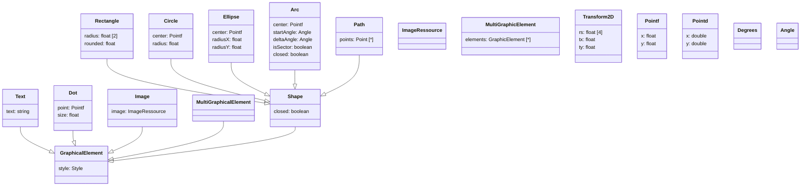

# 2D Graphics

```mermaid
  classDiagram
  %% Class definition
    class GraphicalElement {
        style: Style
    }
    class Dot {
        point: Pointf
        size: float
    }
    class Rectangle {
        radius: float [2]
        rounded: float
    }
    class Circle {
        center: Pointf
        radius: float
    }
    class Ellipse {
        center: Pointf
        radiusX: float
        radiusY: float
    }
    class Arc {
        center: Pointf
        startAngle: Angle
        deltaAngle: Angle
        isSector: boolean
        closed: boolean
    }
    class Path {
        points: Point [*]
    }
    class Text {
        text: string
    }
    class ImageRessource
    class Image {
        image: ImageRessource
    }
    class MultiGraphicElement {
        elements: GraphicElement [*]
    }
    class Transform2D {
        rs: float [4]
        tx: float
        ty: float
    }
    class Shape {
        closed: boolean
    }
    class Pointf {
        x: float
        y: float
    }
    class Pointd {
        x: double
        y: double
    }
    class Degrees
    class Angle
  %% Relations
  %% Inheritance
  Text --|> GraphicalElement
  Dot --|> GraphicalElement
  Image --|> GraphicalElement
  MultiGraphicalElement --|> GraphicalElement
  Shape --|> GraphicalElement

  Rectangle --|> Shape
  Circle --|> Shape
  Ellipse --|> Shape
  Arc --|> Shape
  Path --|> Shape  
```