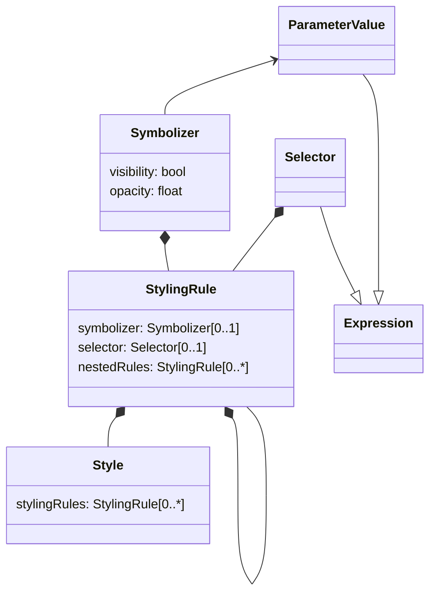

# Symbology Core Model

```mermaid
classDiagram

%% Class definitions
class Style {
   stylingRules: StylingRule[0..*]
}

class StylingRule {
   symbolizer: Symbolizer[0..1]
   selector: Selector[0..1]
   nestedRules: StylingRule[0..*]
}
StylingRule --* StylingRule

class Selector
class Symbolizer {
   visibility: bool
   opacity: float
}
class Expression
class ParameterValue

%% Relations
ParameterValue --|> Expression
Selector --|> Expression
StylingRule *-- Style
Selector *-- StylingRule
Symbolizer *-- StylingRule
ParameterValue <-- Symbolizer
```
