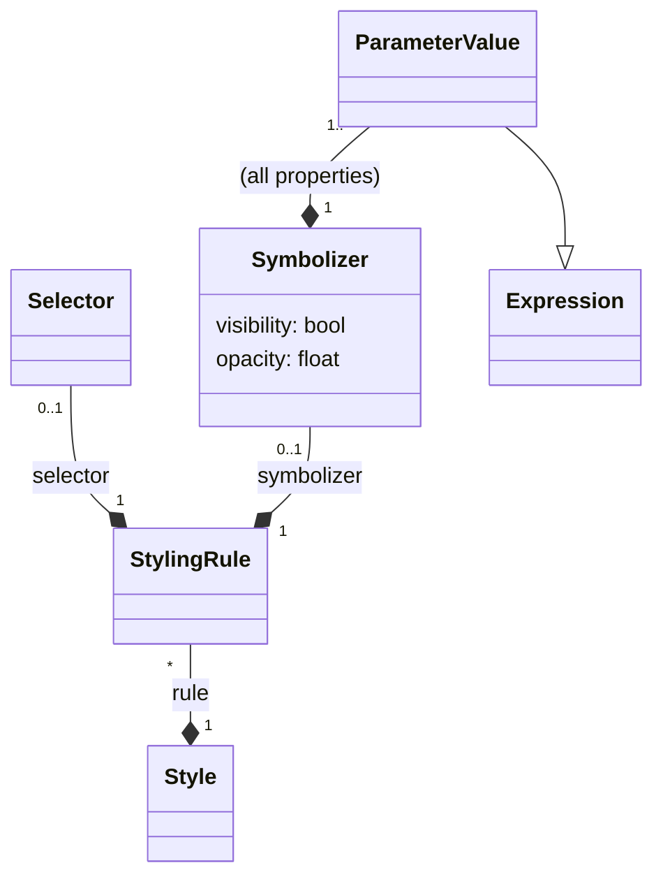

# Symbology Core Model

```mermaid
classDiagram

%%  <|-- AveryLongClass : Cool
%% Class01 : int gorilla

%% Class definitions
class Style
class StylingRule
class Selector
class Symbolizer {
   visibility: bool
   opacity: float
}
class Expression
class ParameterValue

%% Relations
ParameterValue --|> Expression
StylingRule "*" --* "1" Style : rule
Selector "0..1" --* "1" StylingRule : selector
Symbolizer "0..1" --* "1" StylingRule : symbolizer
ParameterValue "1..*" --* "1" Symbolizer : (all properties)
```
