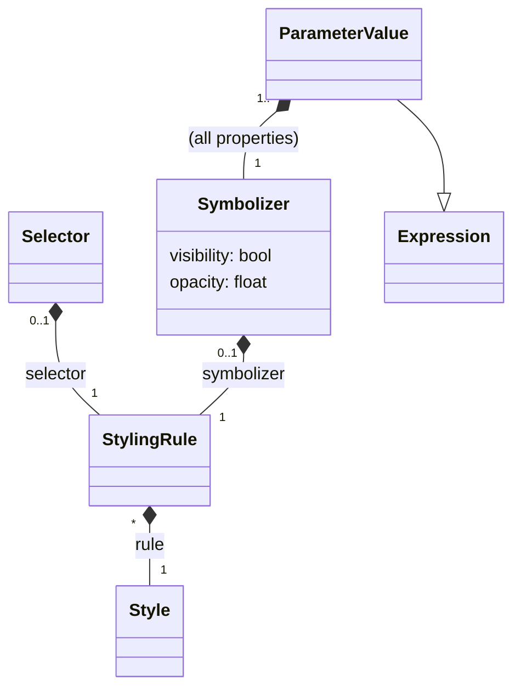

# Symbology Core Model

```mermaid
classDiagram

%% Class definitions
class Style
class StylingRule
class Selector
class Symbolizer {
   visibility: bool
   opacity: float
}
class Expression
class ParameterValue

%% Relations
ParameterValue --|> Expression
StylingRule "*" *-- "1" Style : rule
Selector "0..1" *-- "1" StylingRule : selector
Symbolizer "0..1" *-- "1" StylingRule : symbolizer
ParameterValue "1..*" *-- "1" Symbolizer : (all properties)
```
