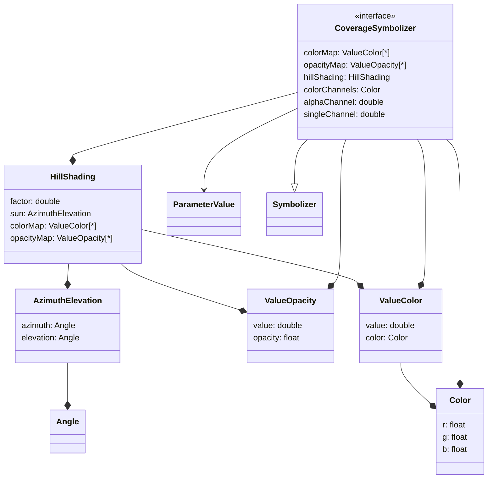

# Coverage Symbolizer

```mermaid
  classDiagram
  %% Class definition
    class ValueColor {
       value: double
       color: Color
    }
    class ValueOpacity {
       value: double
       opacity: float
    }
    class AzimuthElevation {
       azimuth: Angle
       elevation: Angle
    }

    class HillShading {
       factor: double
       sun: AzimuthElevation
       colorMap: ValueColor[*]
       opacityMap: ValueOpacity[*]
    }
    class CoverageSymbolizer {
      <<interface>>
      colorMap: ValueColor[*]
      opacityMap: ValueOpacity[*]
      hillShading: HillShading
      colorChannels: Color
      alphaChannel: double
      singleChannel: double
    }
    class Color {
      r: float
      g: float
      b: float
    }
  %% Relations
  %% Association
    CoverageSymbolizer --> ParameterValue

  %% Inheritance
    CoverageSymbolizer --|> Symbolizer

  %% Composition
    CoverageSymbolizer --* HillShading
    CoverageSymbolizer --* ValueOpacity
    CoverageSymbolizer --* ValueColor
    CoverageSymbolizer --* Color
    ValueColor --* Color
    HillShading --* AzimuthElevation
    HillShading --* ValueColor
    HillShading --* ValueOpacity
    AzimuthElevation --* Angle
```
