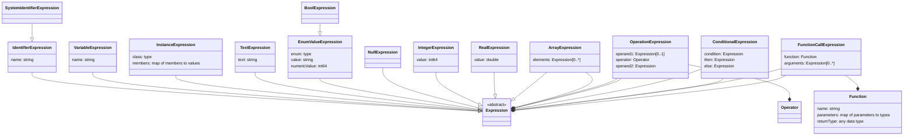

# Expressions

```mermaid
classDiagram

%% Expression Classes
class Expression {
   <<abstract>>
}

class IdentifierExpression {
   name: string
}
IdentifierExpression --|> Expression

class VariableExpression {
   name: string
}
VariableExpression --|> Expression

class InstanceExpression {
   class: type
   members: map of members to values
}
InstanceExpression --|> Expression

class TextExpression {
   text: string
}
TextExpression --|> Expression

class EnumValueExpression {
   enum: type
   value: string
   numericValue: int64
}
EnumValueExpression --|> Expression

class BoolExpression
BoolExpression --|> EnumValueExpression

class NullExpression
NullExpression --|> Expression

class IntegerExpression {
   value: int64
}
IntegerExpression --|> Expression

class RealExpression {
   value: double
}
RealExpression --|> Expression

%% class SubExpression
%% SubExpression --|> Expression -- Parentheses could be purely an encoding concept based on the need to maintain priority...

%% class ExpressionList -- Expression with multiplicity?

class ArrayExpression {
   elements: Expression[0..*]
}
ArrayExpression --|> Expression
ArrayExpression --* Expression

class OperationExpression {
   operand1: Expression[0..1]
   operator: Operator
   operand2: Expression
}
OperationExpression --|> Expression
OperationExpression --* Operator
OperationExpression --* Expression

class ConditionalExpression {
   condition: Expression
   then: Expression
   else: Expression
}
ConditionalExpression --|> Expression
ConditionalExpression --* Expression

class FunctionCallExpression {
   function: Function
   arguments: Expression[0..*]
}
FunctionCallExpression --|> Expression
FunctionCallExpression --* Function
FunctionCallExpression --* Expression


class Function {
   name: string
   parameters: map of parameters to types
   returnType: any data type
}

SystemIdentifierExpression --|> IdentifierExpression

```
