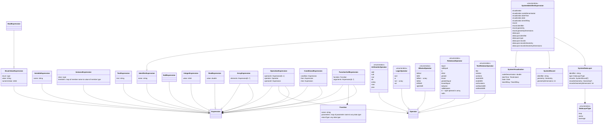

```mermaid
classDiagram

%% Expression Classes
class Expression

class IdentifierExpression {
   name: string
}
IdentifierExpression --|> Expression

class VariableExpression {
   name: string
}
VariableExpression --|> Expression

class InstanceExpression {
   class: type
   members: map of member name to value of member type
}
InstanceExpression --|> Expression

class TextExpression {
   text: string
}
TextExpression --|> Expression

class EnumValueExpression {
   enum: type
   value: string
   numericValue: int64
}
EnumValueExpression --|> Expression

class BoolExpression
BoolExpression --|> EnumValueExpression

class NullExpression
NullExpression --|> Expression

class IntegerExpression {
   value: int64
}
IntegerExpression --|> Expression

class RealExpression {
   value: double
}
RealExpression --|> Expression

%% class SubExpression
%% SubExpression --|> Expression -- Parentheses could be purely an encoding concept based on the need to maintain priority...

%% class ExpressionList -- Expression with multiplicity?

class ArrayExpression {
   elements: Expression[0..*]
}
ArrayExpression --|> Expression
ArrayExpression --* Expression

class OperationExpression {
   operand1: Expression[0..1]
   operator: Operator
   operand2: Expression
}
OperationExpression --|> Expression
OperationExpression --* Operator
OperationExpression --* Expression

class ConditionalExpression {
   condition: Expression
   then: Expression
   else: Expression
}
ConditionalExpression --|> Expression
ConditionalExpression --* Expression

%% Operators
class FunctionCallExpression {
   function: Function
   arguments: Expression[0..*]
}
FunctionCallExpression --|> Expression
FunctionCallExpression --* Function
FunctionCallExpression --* Expression

class Operator

class ArithmeticOperator {
   <<enumeration>>
   add
   sub
   mul
   div
   intDiv
   mod
   pow
}
ArithmeticOperator --|> Operator

class LogicOperator {
   <<enumeration>>
   and
   or
   not -- unary
   xor
}
LogicOperator --|> Operator

class BitwiseOperator {
   <<enumeration>>
   bitAnd
   bitOr
   bitNot -- unary
   bitXor
   leftShift
   rightShift
}
BitwiseOperator --|> Operator

class RelationalOperator {
   <<enumeration>>
   equal
   notEqual
   is
   isNot
   greater
   lesser
   greaterEqual
   lesserEqual
   between
   notBetween
   in -- right operand is array
   notIn
}
RelationalOperator --|> Operator

class TextRelationOperator {
   <<enumeration>>
   like
   notLike
   contains
   startsWith
   endsWith
   notContains
   notStartsWith
   notEndsWith
}
TextRelationOperator --|> Operator

class Function {
   name: string
   parameters: map of parameter name to any data type
   returnType: any data type
}

class SystemVisualization {
   scaleDenominator: double
   dateTime: TimeInstant
   Date: Date
   timeOfDay: TimeOfDay
}

class SystemRecord {
   identifier: string
   geometry: Geometry
   geometryDimensions: int
}

class DataLayerType {
   <<enumeration>>
   map
   vector
   coverage
}

class SystemDataLayer {
   identifier: string
   type: DataLayerType
   records: SystemRecord[*]
   recordsGeometry: Geometry[*]
   recordsGeometryDimensions: int
}

class SystemIdentifierExpression {
   <<enumeration>>

   visualization
   visualization.scaleDenominator
   visualization.dateTime
   visualization.date
   visualization.timeOfDay
   record
   record.identifier
   record.geometry
   record.geometryDimensions
   dataLayer
   dataLayer.identifier
   dataLayer.type
   dataLayer.records
   dataLayer.recordsGeometry
   dataLayer.recordsGeometryDimensions
}
SystemIdentifierExpression --|> IdentifierExpression
SystemIdentifierExpression --> SystemVisualization
SystemIdentifierExpression --> SystemRecord
SystemIdentifierExpression --> SystemDataLayer
SystemDataLayer --* DataLayerType
```
