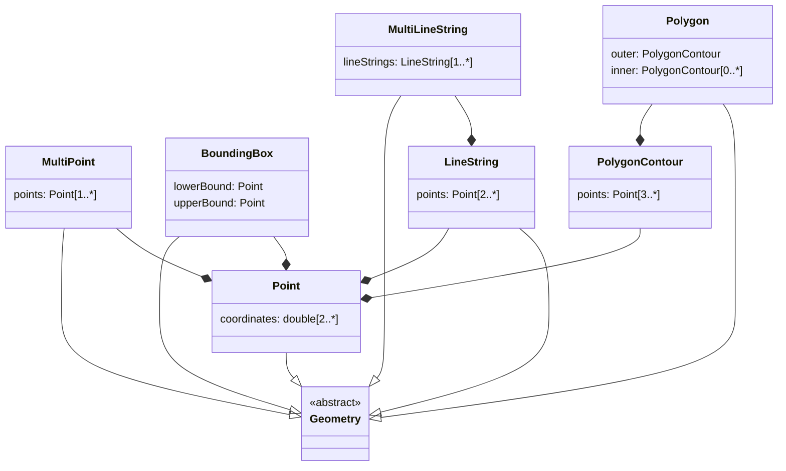

# Geometry

```mermaid
classDiagram

class Geometry {
   <<abstract>>
}

class Point {
   coordinates: double[2..*]
}
Point --|> Geometry

class MultiPoint {
   points: Point[1..*]
}
MultiPoint --|> Geometry
MultiPoint --* Point

class BoundingBox {
   lowerBound: Point
   upperBound: Point
}
BoundingBox --|> Geometry
BoundingBox --* Point

class LineString {
   points: Point[2..*]
}
LineString --* Point
LineString --|> Geometry

class MultiLineString {
   lineStrings: LineString[1..*]
}
MultiLineString --|> Geometry
MultiLineString --* LineString

class PolygonContour {
   points: Point[3..*]
}
PolygonContour --* Point

class Polygon {
   outer: PolygonContour
   inner: PolygonContour[0..*]
}
Polygon --* PolygonContour
Polygon --|> Geometry

```
