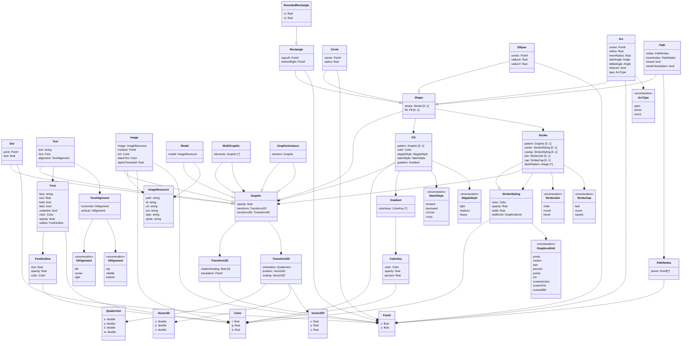

# Graphics

```mermaid
  classDiagram
  %% Class definition
    class Graphic {
        opacity: float
        transform: Transform2D
        transform3D: Transform3D
    }
    class Shape {
        stroke: Stroke [0..1]
        fill: Fill [0..1]
    }
    class Dot {
        point: Pointf
        size: float
    }
    class Rectangle {
       topLeft: Pointf
       bottomRight: Pointf
    }
    class RoundedRectangle {
        rx: float
        ry: float
    }
    class Circle {
        center: Pointf
        radius: float
    }
    class Ellipse {
        center: Pointf
        radiusX: float
        radiusY: float
    }
    class ArcType {
       <<enumeration>>
       open
       sector
       chord
    }

    class Arc {
        center: Pointf
        radius: float
        innerRadius: float
        startAngle: Angle
        deltaAngle: Angle
        isSector: bool
        type: ArcType
    }
    class PathNodes {
       points: Pointf[*]
    }
    class Path {
        nodes: PathNodes
        innerNodes: PathNodes
        closed: bool
        needsTesselation: bool
    }
    class TextAlignment {
      horizontal: HAlignment
      vertical: VAlignment
    }
    class HAlignment {
      <<enumeration>>
      left
      center
      right
    }
    class VAlignment {
      <<enumeration>>
      top
      middle
      bottom
    }
    class FontOutline {
       size: float
       opacity: float
       color: Color
    }
    class Font {
      face: string
      size: float
      bold: bool
      italic: bool
      underline: bool
      color: Color
      opacity: float
      outline: FontOutline
    }

    class Text {
        text: string
        font: Font
        alignment: TextAlignment
    }
    class ImageResource {
       path: string
       id: string
       url: string
       ext: string
       type: string
       sprite: string
    }
    class Image {
        image: ImageResource
        hotSpot: Pointf
        tint: Color
        blackTint: Color
        alphaThreshold: float
    }
    class Model {
        model: ImageResource
    }
    class MultiGraphic {
        elements: Graphic [*]
    }
    class GraphicInstance {
       element: Graphic
    }
    class Vector3D {
       x: double
       y: double
       z: double
    }
    class Vector3Df {
       x: float
       y: float
       z: float
    }
    class Quaternion {
       x: double
       y: double
       z: double
       w: double
    }
    class Transform3D {
        orientation: Quaternion
        position: Vector3D
        scaling: Vector3Df
    }
    class Transform2D {
        rotationScaling: float [4]
        translation: Pointf
    }
    class Pointf {
        x: float
        y: float
    }

    class Color {
      r: float
      g: float
      b: float
    }
    class Gradient {
        colorKeys: ColorKey [*]
    }
    class ColorKey {
      color: Color
      opacity: float
      percent: float
    }
    class StippleStyle {
      <<enumeration>>
      light
      medium
      heavy
    }
    class HatchStyle {
      <<enumeration>>
      forward
      backward
      xCross
      cross
    }
    class StrokeJoin {
      <<enumeration>>
      miter
      round
      bevel
    }
    class StrokeCap {
      <<enumeration>>
      butt
      round
      square
    }
    class Fill {
      pattern: Graphic [0..1]
      color: Color
      stippleStyle: StippleStyle
      hatchStyle: HatchStyle
      gradient: Gradient
    }
    class GraphicalUnit {
       <<enumeration>>
       pixels
       meters
       feet
       percent
       points
       em
       screenInches
       screenCM
       screenMM
    }
    class StrokeStyling {
       color: Color
       opacity: float
       width: float
       widthUnit: GraphicalUnit
    }
    class Stroke {
      pattern: Graphic [0..1]
      center: StrokeStyling [0..1]
      casing: StrokeStyling [0..1]
      join: StrokeJoin [0..1]
      cap: StrokeCap [0..1]
      dashPattern: integer [*]
    }

  %% Relations
  %% Inheritance
  Text --|> Graphic
  Dot --|> Graphic
  Image --|> Graphic
  MultiGraphic --|> Graphic
  Shape --|> Graphic
  Rectangle --|> Shape
  Circle --|> Shape
  Ellipse --|> Shape
  Arc --|> Shape
  Path --|> Shape
  RoundedRectangle --|> Rectangle
  GraphicInstance --|> Graphic
  Stroke --|> StrokeStyling
  Model --|> Graphic

  %% Composition
  PathNodes --* Pointf
  Path --* PathNodes
  Dot --* Pointf
  Circle --* Pointf
  Ellipse --* Pointf
  Rectangle --* Pointf
  Arc --* Pointf
  Arc --* ArcType
  Graphic --* Transform2D
  Graphic --* Transform3D
  Transform3D --* Quaternion
  Transform3D --* Vector3D
  Transform3D --* Vector3Df
  Transform2D --* Pointf
  Image --* ImageResource
  Image --* Color
  Image --* Pointf
  Model --* ImageResource
  MultiGraphic --* Graphic
  Text --* Font
  Text --* TextAlignment
  Font --* FontOutline
  Font --* Color
  FontOutline --* Color
  TextAlignment --* HAlignment
  TextAlignment --* VAlignment
  Shape --* Fill
  Shape --* Stroke

  Fill --* Graphic
  Fill --* Color
  Fill --* Gradient
  Fill --* HatchStyle
  Fill --* StippleStyle
  ColorKey --* Color
  Gradient --* ColorKey
  StrokeStyling --* Color
  StrokeStyling --* GraphicalUnit
  Stroke --* Graphic
  Stroke --* StrokeStyling
  Stroke --* StrokeJoin
  Stroke --* StrokeCap

  %% Aggregation
  GraphicInstance --o Graphic

```
