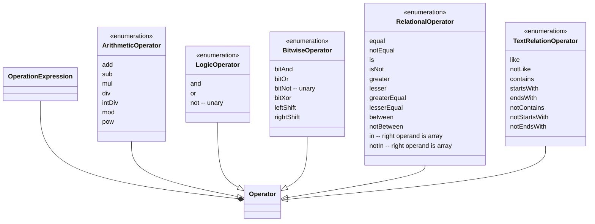

# Operators

```mermaid
classDiagram

%% Operators
class Operator

OperationExpression --* Operator

class ArithmeticOperator {
   <<enumeration>>
   add
   sub
   mul
   div
   intDiv
   mod
   pow
}
ArithmeticOperator --|> Operator

class LogicOperator {
   <<enumeration>>
   and
   or
   not -- unary
}
LogicOperator --|> Operator

class BitwiseOperator {
   <<enumeration>>
   bitAnd
   bitOr
   bitNot -- unary
   bitXor
   leftShift
   rightShift
}
BitwiseOperator --|> Operator

class RelationalOperator {
   <<enumeration>>
   equal
   notEqual
   is
   isNot
   greater
   lesser
   greaterEqual
   lesserEqual
   between
   notBetween
   in -- right operand is array
   notIn -- right operand is array
}
RelationalOperator --|> Operator

class TextRelationOperator {
   <<enumeration>>
   like
   notLike
   contains
   startsWith
   endsWith
   notContains
   notStartsWith
   notEndsWith
}
TextRelationOperator --|> Operator
```
