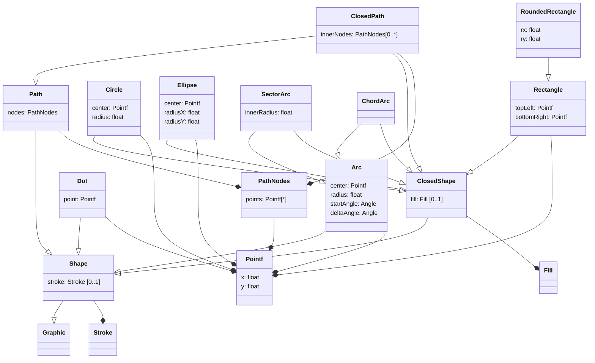

# Shapes

```mermaid
  classDiagram
  %% Class definition
    class Shape {
        stroke: Stroke [0..1]
    }
    class ClosedShape {
        fill: Fill [0..1]
    }
    class Dot {
        point: Pointf
    }
    class Rectangle {
       topLeft: Pointf
       bottomRight: Pointf
    }
    class RoundedRectangle {
        rx: float
        ry: float
    }
    class Circle {
        center: Pointf
        radius: float
    }
    class Ellipse {
        center: Pointf
        radiusX: float
        radiusY: float
    }

    class SectorArc {
        innerRadius: float
    }

    class ChordArc {
    }

    class Arc {
        center: Pointf
        radius: float
        startAngle: Angle
        deltaAngle: Angle
    }
    class PathNodes {
       points: Pointf[*]
    }
    class ClosedPath {
        innerNodes: PathNodes[0..*]
    }

    class Path {
        nodes: PathNodes
    }
    class Pointf {
        x: float
        y: float
    }

  %% Relations
  %% Inheritance
  Dot --|> Shape
  Shape --|> Graphic
  Rectangle --|> ClosedShape
  Circle --|> ClosedShape
  Ellipse --|>Closed Shape
  Arc --|> Shape
  SectorArc --|> Arc
  SectorArc --|> ClosedShape
  ChordArc --|> Arc
  ChordArc --|> ClosedShape
  Path --|> Shape
  RoundedRectangle --|> Rectangle
  ClosedPath --|> Path
  ClosedPath --|> ClosedShape
  ClosedShape --|> Shape

  %% Composition
  PathNodes --* Pointf
  ClosedPath --* PathNodes
  Path --* PathNodes
  Dot --* Pointf
  Circle --* Pointf
  Ellipse --* Pointf
  Rectangle --* Pointf
  Arc --* Pointf
  ClosedShape --* Fill
  Shape --* Stroke

  %% Aggregation

```
