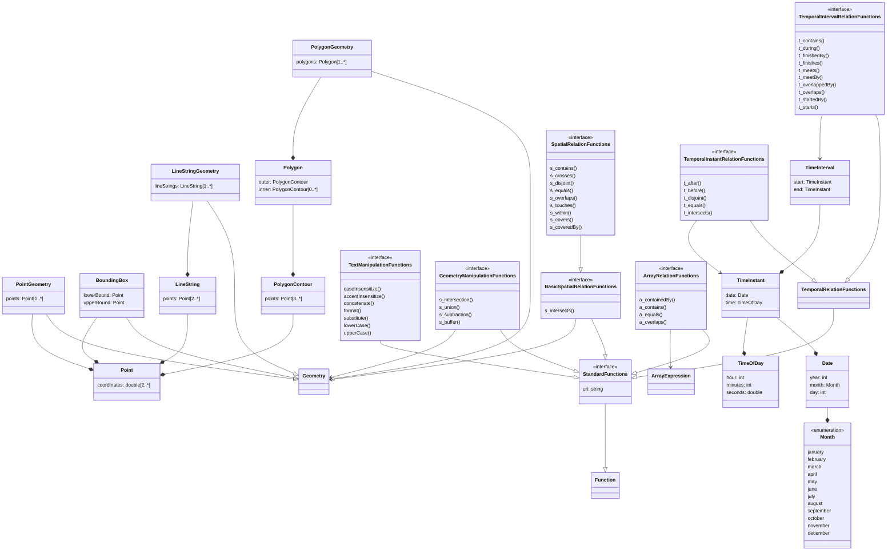

```mermaid
classDiagram

class Geometry

class Point {
   coordinates: double[2..*]
}

class PointGeometry {
   points: Point[1..*]
}
PointGeometry --|> Geometry
PointGeometry --* Point

class BoundingBox {
   lowerBound: Point
   upperBound: Point
}
BoundingBox --|> Geometry
BoundingBox --* Point

class LineString {
   points: Point[2..*]
}
LineString --* Point

class LineStringGeometry {
   lineStrings: LineString[1..*]
}
LineStringGeometry --|> Geometry
LineStringGeometry --* LineString

class PolygonContour {
   points: Point[3..*]
}
PolygonContour --* Point

class Polygon {
   outer: PolygonContour
   inner: PolygonContour[0..*]
}
Polygon --* PolygonContour

class PolygonGeometry {
   polygons: Polygon[1..*]
}
PolygonGeometry --|> Geometry
PolygonGeometry --* Polygon

class Month {
   <<enumeration>>
   january
   february
   march
   april
   may
   june
   july
   august
   september
   october
   november
   december
}

class Date {
   year: int
   month: Month
   day: int
}
Date --* Month

class TimeOfDay {
   hour: int
   minutes: int
   seconds: double
}

class TimeInstant {
   date: Date
   time: TimeOfDay
}
TimeInstant --* Date
TimeInstant --* TimeOfDay

class TimeInterval {
   start: TimeInstant
   end: TimeInstant
}
TimeInterval --* TimeInstant

class StandardFunctions {
   <<interface>>
   uri: string
}
StandardFunctions --|> Function

class TextManipulationFunctions {
   <<interface>>
   caseInsensitize()
   accentInsensitize()
   concatenate()
   format()
   substitute()
   lowerCase()
   upperCase()
}
TextManipulationFunctions --|> StandardFunctions

class GeometryManipulationFunctions {
   <<interface>>
   s_intersection()
   s_union()
   s_subtraction()
   s_buffer()
}
GeometryManipulationFunctions --|> StandardFunctions
GeometryManipulationFunctions --> Geometry

class BasicSpatialRelationFunctions {
   <<interface>>
   s_intersects()
}
BasicSpatialRelationFunctions --|> StandardFunctions
BasicSpatialRelationFunctions --> Geometry

class SpatialRelationFunctions {
   <<interface>>
   s_contains()
   s_crosses()
   s_disjoint()
   s_equals()
   s_overlaps()
   s_touches()
   s_within()
   s_covers()
   s_coveredBy()
}
SpatialRelationFunctions --|> BasicSpatialRelationFunctions

class TemporalRelationFunctions
TemporalRelationFunctions --|> StandardFunctions

%% Accepting either instant or intervals
class TemporalInstantRelationFunctions {
   <<interface>>

   t_after()
   t_before()
   t_disjoint()
   t_equals()
   t_intersects()
}
TemporalInstantRelationFunctions --|> TemporalRelationFunctions
TemporalInstantRelationFunctions --> TimeInstant

%% Accepting only intervals
class TemporalIntervalRelationFunctions {
   <<interface>>

   t_contains()
   t_during()
   t_finishedBy()
   t_finishes()
   t_meets()
   t_meetBy()
   t_overlappedBy()
   t_overlaps()
   t_startedBy()
   t_starts()
}
TemporalIntervalRelationFunctions --|> TemporalRelationFunctions
TemporalIntervalRelationFunctions --> TimeInterval

class ArrayRelationFunctions {
   <<interface>>

   a_containedBy()
   a_contains()
   a_equals()
   a_overlaps()
}
ArrayRelationFunctions --|> StandardFunctions
ArrayRelationFunctions --> ArrayExpression
```
