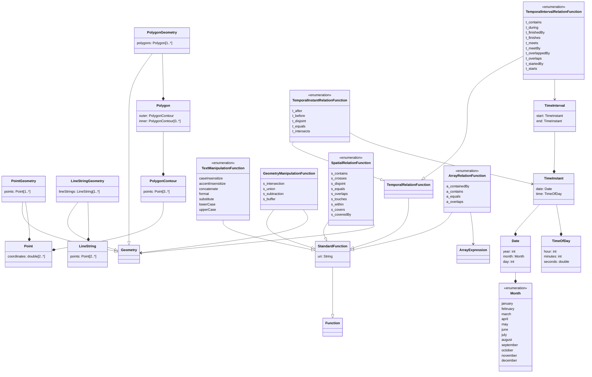

```mermaid
classDiagram

class Geometry

class Point {
   coordinates: double[2..*]
}

class PointGeometry {
   points: Point[1..*]
}
PointGeometry --|> Geometry
PointGeometry --* Point

class LineString {
   points: Point[2..*]
}

class LineStringGeometry {
   lineStrings: LineString[1..*]
}
LineStringGeometry --|> Geometry
LineStringGeometry --* LineString

class PolygonContour {
   points: Point[3..*]
}
PolygonContour --* Point

class Polygon {
   outer: PolygonContour
   inner: PolygonContour[0..*]
}
Polygon --* PolygonContour

class PolygonGeometry {
   polygons: Polygon[1..*]
}
PolygonGeometry --|> Geometry
PolygonGeometry --* Polygon

class Month {
   <<enumeration>>
   january
   february
   march
   april
   may
   june
   july
   august
   september
   october
   november
   december
}

class Date {
   year: int
   month: Month
   day: int
}
Date --* Month

class TimeOfDay {
   hour: int
   minutes: int
   seconds: double
}

class TimeInstant {
   date: Date
   time: TimeOfDay
}
TimeInstant --* Date
TimeInstant --* TimeOfDay

class TimeInterval {
   start: TimeInstant
   end: TimeInstant
}
TimeInterval --* TimeInstant

class StandardFunction {
   uri: String
}
StandardFunction --|> Function

class TextManipulationFunction {
   <<enumeration>>
   caseInsensitize
   accentInsensitize
   concatenate
   format
   substitute
   lowerCase
   upperCase
}
TextManipulationFunction --|> StandardFunction

class GeometryManipulationFunction {
   s_intersection
   s_union
   s_subtraction
   s_buffer
}
GeometryManipulationFunction --|> StandardFunction
GeometryManipulationFunction --> Geometry

class SpatialRelationFunction {
   <<enumeration>>
   s_contains
   s_crosses
   s_disjoint
   s_equals
   s_overlaps
   s_touches
   s_within
   s_covers
   s_coveredBy
}
SpatialRelationFunction --|> StandardFunction
SpatialRelationFunction --> Geometry

class TemporalRelationFunction
TemporalRelationFunction --|> StandardFunction

%% Accepting either instant or intervals
class TemporalInstantRelationFunction {
   <<enumeration>>

   t_after
   t_before
   t_disjoint
   t_equals
   t_intersects
}
TemporalInstantRelationFunction --|> TemporalRelationFunction
TemporalInstantRelationFunction --> TimeInstant

%% Accepting only intervals
class TemporalIntervalRelationFunction {
   <<enumeration>>

   t_contains
   t_during
   t_finishedBy
   t_finishes
   t_meets
   t_meetBy
   t_overlappedBy
   t_overlaps
   t_startedBy
   t_starts
}
TemporalIntervalRelationFunction --|> TemporalRelationFunction
TemporalIntervalRelationFunction --> TimeInterval

class ArrayRelationFunction {
   <<enumeration>>

   a_containedBy
   a_contains
   a_equals
   a_overlaps
}
ArrayRelationFunction --|> StandardFunction
ArrayRelationFunction --> ArrayExpression
```
