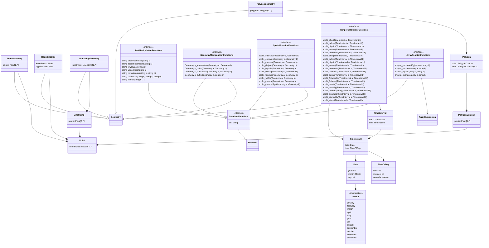

```mermaid
classDiagram

class Geometry

class Point {
   coordinates: double[2..*]
}

class PointGeometry {
   points: Point[1..*]
}
PointGeometry --|> Geometry
PointGeometry --* Point

class BoundingBox {
   lowerBound: Point
   upperBound: Point
}
BoundingBox --|> Geometry
BoundingBox --* Point

class LineString {
   points: Point[2..*]
}
LineString --* Point

class LineStringGeometry {
   lineStrings: LineString[1..*]
}
LineStringGeometry --|> Geometry
LineStringGeometry --* LineString

class PolygonContour {
   points: Point[3..*]
}
PolygonContour --* Point

class Polygon {
   outer: PolygonContour
   inner: PolygonContour[0..*]
}
Polygon --* PolygonContour

class PolygonGeometry {
   polygons: Polygon[1..*]
}
PolygonGeometry --|> Geometry
PolygonGeometry --* Polygon

class Month {
   <<enumeration>>
   january
   february
   march
   april
   may
   june
   july
   august
   september
   october
   november
   december
}

class Date {
   year: int
   month: Month
   day: int
}
Date --* Month

class TimeOfDay {
   hour: int
   minutes: int
   seconds: double
}

class TimeInstant {
   date: Date
   time: TimeOfDay
}
TimeInstant --* Date
TimeInstant --* TimeOfDay

class TimeInterval {
   start: TimeInstant
   end: TimeInstant
}
TimeInterval --* TimeInstant

class StandardFunctions {
   <<interface>>
   uri: string
}
StandardFunctions --|> Function

class TextManipulationFunctions {
   <<interface>>
   string caseInsensitize(string s)
   string accentInsensitize(string s)
   string lowerCase(string s)
   string upperCase(string s)
   string concatenate(string a, string b)
   string substitute(string s, string a, string b)
   string format(string f, ...)
}
TextManipulationFunctions --|> StandardFunctions

class GeometryManipulationFunctions {
   <<interface>>
   Geometry s_intersection(Geometry a, Geometry b)
   Geometry s_union(Geometry a, Geometry b)
   Geometry s_subtraction(Geometry a, Geometry b)
   Geometry s_buffer(Geometry a, double d)
}
GeometryManipulationFunctions --|> StandardFunctions
GeometryManipulationFunctions --> Geometry

class SpatialRelationFunctions {
   <<interface>>
   bool s_intersects(Geometry a, Geometry b)
   bool s_contains(Geometry a, Geometry b)
   bool s_crosses(Geometry a, Geometry b)
   bool s_disjoint(Geometry a, Geometry b)
   bool s_equals(Geometry a, Geometry b)
   bool s_overlaps(Geometry a, Geometry b)
   bool s_touches(Geometry a, Geometry b)
   bool s_within(Geometry a, Geometry b)
   bool s_covers(Geometry a, Geometry b)
   bool s_coveredBy(Geometry a, Geometry b)
}
SpatialRelationFunctions --|> StandardFunctions
SpatialRelationFunctions --> Geometry

class TemporalRelationFunctions {
   <<interface>>
   bool t_after(TimeInstant a, TimeInstant b)
   bool t_before(TimeInstant a, TimeInstant b)
   bool t_disjoint(TimeInstant a, TimeInstant b)
   bool t_equals(TimeInstant a, TimeInstant b)
   bool t_intersects(TimeInstant a, TimeInstant b)

   bool t_after(TimeInterval a, TimeInterval b)
   bool t_before(TimeInterval a, TimeInterval b)
   bool t_disjoint(TimeInterval a, TimeInterval b)
   bool t_equals(TimeInterval a, TimeInterval b)
   bool t_intersects(TimeInterval a, TimeInterval b)
   bool t_contains(TimeInterval a, TimeInterval b)
   bool t_during(TimeInterval a, TimeInterval b)
   bool t_finishedBy(TimeInterval a, TimeInterval b)
   bool t_finishes(TimeInterval a, TimeInterval b)
   bool t_meets(TimeInterval a, TimeInterval b)
   bool t_meetBy(TimeInterval a, TimeInterval b)
   bool t_overlappedBy(TimeInterval a, TimeInterval b)
   bool t_overlaps(TimeInterval a, TimeInterval b)
   bool t_startedBy(TimeInterval a, TimeInterval b)
   bool t_starts(TimeInterval a, TimeInterval b)
}

TemporalRelationFunctions --|> StandardFunctions
TemporalRelationFunctions --> TimeInstant
TemporalRelationFunctions --> TimeInterval

class ArrayRelationFunctions {
   <<interface>>

   array a_containedBy(array a, array b)
   array a_contains(array a, array b)
   array a_equals(array a, array b)
   array a_overlaps(array a, array b)
}
ArrayRelationFunctions --|> StandardFunctions
ArrayRelationFunctions --> ArrayExpression
```
