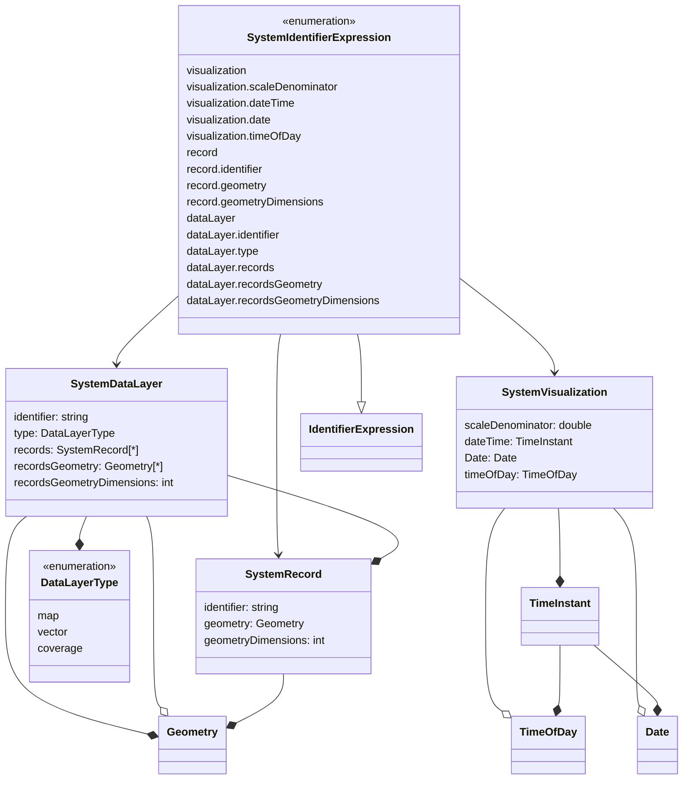

# System Identifiers

```mermaid

classDiagram

class SystemVisualization {
   scaleDenominator: double
   dateTime: TimeInstant
   Date: Date
   timeOfDay: TimeOfDay
}

class SystemRecord {
   identifier: string
   geometry: Geometry
   geometryDimensions: int
}

class DataLayerType {
   <<enumeration>>
   map
   vector
   coverage
}

class SystemDataLayer {
   identifier: string
   type: DataLayerType
   records: SystemRecord[*]
   recordsGeometry: Geometry[*]
   recordsGeometryDimensions: int
}

class SystemIdentifierExpression {
   <<enumeration>>

   visualization
   visualization.scaleDenominator
   visualization.dateTime
   visualization.date
   visualization.timeOfDay
   record
   record.identifier
   record.geometry
   record.geometryDimensions
   dataLayer
   dataLayer.identifier
   dataLayer.type
   dataLayer.records
   dataLayer.recordsGeometry
   dataLayer.recordsGeometryDimensions
}
SystemIdentifierExpression --|> IdentifierExpression
SystemIdentifierExpression --> SystemVisualization
SystemIdentifierExpression --> SystemRecord
SystemIdentifierExpression --> SystemDataLayer
SystemDataLayer --* DataLayerType
SystemDataLayer --* Geometry
SystemDataLayer --* SystemRecord
SystemDataLayer --o Geometry
SystemRecord --* Geometry
SystemVisualization --* TimeInstant
SystemVisualization --o Date
SystemVisualization --o TimeOfDay
TimeInstant --* Date
TimeInstant --* TimeOfDay
```
