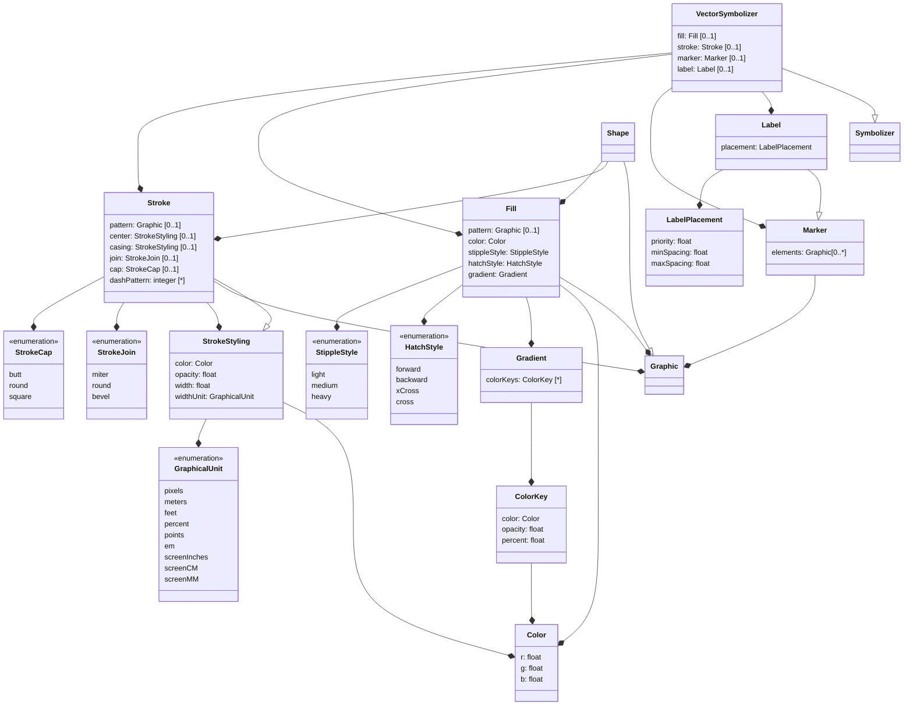

# Vector Features Symbolizer

```mermaid
  classDiagram
  %% Class definition
    %% Note: Symbolizer, StylingRule and Style are defined in core.md
    class Symbolizer
    class VectorSymbolizer {
      fill: Fill [0..1]
      stroke: Stroke [0..1]
      marker: Marker [0..1]
      label: Label [0..1]
    }

    class Color {
      r: float
      g: float
      b: float
    }
    class Gradient {
        colorKeys: ColorKey [*]
    }
    class ColorKey {
      color: Color
      opacity: float
      percent: float
    }
    class StippleStyle {
      <<enumeration>>
      light
      medium
      heavy
    }
    class HatchStyle {
      <<enumeration>>
      forward
      backward
      xCross
      cross
    }
    class StrokeJoin {
      <<enumeration>>
      miter
      round
      bevel
    }
    class StrokeCap {
      <<enumeration>>
      butt
      round
      square
    }
    class Fill {
      pattern: Graphic [0..1]
      color: Color
      stippleStyle: StippleStyle
      hatchStyle: HatchStyle
      gradient: Gradient
    }
    class GraphicalUnit {
       <<enumeration>>
       pixels
       meters
       feet
       percent
       points
       em
       screenInches
       screenCM
       screenMM
    }
    class StrokeStyling {
       color: Color
       opacity: float
       width: float
       widthUnit: GraphicalUnit
    }
    class Stroke {
      pattern: Graphic [0..1]
      center: StrokeStyling [0..1]
      casing: StrokeStyling [0..1]
      join: StrokeJoin [0..1]
      cap: StrokeCap [0..1]
      dashPattern: integer [*]
    }
    class Marker {
      elements: Graphic[0..*]
    }
    class LabelPlacement {
      priority: float
      minSpacing: float
      maxSpacing: float
    }
    class Label {
      placement: LabelPlacement
    }
    class Graphic
    class Shape
  %% Relations
  %% Association
  %% Inheritance
    Stroke --|> StrokeStyling
    VectorSymbolizer --|> Symbolizer
    Label --|> Marker
    Shape --|> Graphic
  %% Composition
    StrokeStyling --* Color
    StrokeStyling --* GraphicalUnit
    VectorSymbolizer --* Label
    VectorSymbolizer --* Marker
    VectorSymbolizer --* Fill
    VectorSymbolizer --* Stroke
    ColorKey --* Color
    Gradient --* ColorKey
    Marker --* Graphic
    Stroke --* Graphic
    Stroke --* StrokeStyling
    Stroke --* StrokeJoin
    Stroke --* StrokeCap
    Fill --* Graphic
    Fill --* Color
    Fill --* Gradient
    Fill --* HatchStyle
    Fill --* StippleStyle
    Label --* LabelPlacement
    Shape --* Stroke
    Shape --* Fill
```
