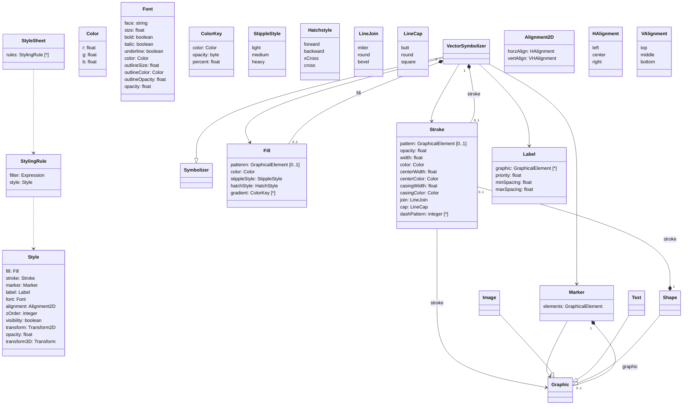

# Vector Features Symbolizer

```mermaid
  classDiagram
  %% Class definition
    class Style {
      fill: Fill
      stroke: Stroke
      marker: Marker
      label: Label
      font: Font
      alignment: Alignment2D
      zOrder: integer
      visibility: boolean
      transform: Transform2D
      opacity: float
      transform3D: Transform
    }
    class StylingRule {
      filter: Expression
      style: Style
    }
    class StyleSheet {
      rules: StylingRule [*]
    }
    class Color {
      r: float
      g: float
      b: float
    }
    class Font {
      face: string
      size: float
      bold: boolean
      italic: boolean
      underline: boolean
      color: Color
      outlineSize: float
      outlineColor: Color
      outlineOpacity: float
      opacity: float
    }
    class Color
    class ColorKey {
      color: Color
      opacity: byte
      percent: float
    }
    class StippleStyle {
      light
      medium
      heavy
    }
    class Hatchstyle {
      forward
      backward
      xCross
      cross
    }
    class LineJoin {
      miter
      round
      bevel
    }
    class LineCap {
      butt
      round
      square
    }
    class Marker {
      elements: GraphicalElement
    }
    class Symbolizer
    class VectorSymbolizer
    class Fill {
      pattenrn: GraphicalElement [0..1] 
      color: Color
      stippleStyle: StippleStyle
      hatchStyle: HatchStyle
      gradient: ColorKey [*] 
    }
    class Alignment2D {
      horzAlign: HAlignment
      vertAlign: VHAlignment 
    }
    class HAlignment {
      left
      center
      right
    }
        class VAlignment {
      top
      middle
      bottom
    }
    class Stroke {
      pattern: GraphicalElement [0..1]
      opacity: float
      width: float
      color: Color
      centerWidth: float
      centerColor: Color
      casingWidth: float
      casingColor: Color
      join: LineJoin
      cap: LineCap
      dashPattern: integer [*]  
    }
    class Label {
      graphic: GraphicalElement [*]
      priority: float
      minSpacing: float
      maxSpacing: float
    }
    class Graphic
    class Image
    class Text
    class Shape
  %% Relations
  %% Association
    VectorSymbolizer --> Fill
    VectorSymbolizer --> Stroke
    VectorSymbolizer --> Label
    VectorSymbolizer --> Marker
    Stroke --> Graphic : stroke
    Marker --> Graphic
    StyleSheet ..> StylingRule
    StylingRule ..> Style
  %% Inheritance
    VectorSymbolizer --|> Symbolizer
    Image --|> Graphic
    Text --|> Graphic
    Shape --|> Graphic
  %% Composition
    Fill "0..1" --* "1" VectorSymbolizer : fill
    Stroke "0..1" --* "1" VectorSymbolizer : stroke
    Graphic "0..1" --* "1" Marker : graphic
    Stroke "0..1" --* "1" Shape : stroke
```
